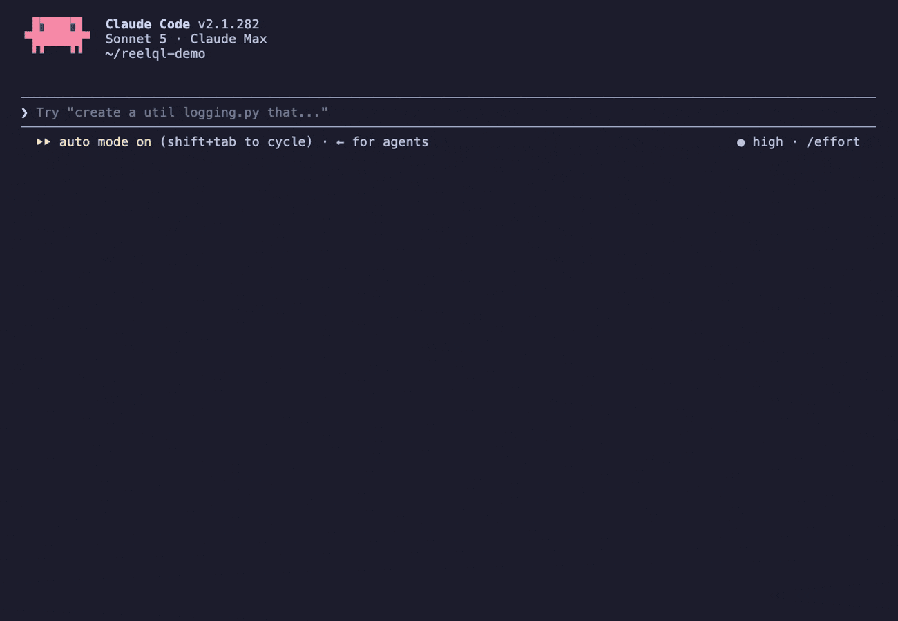
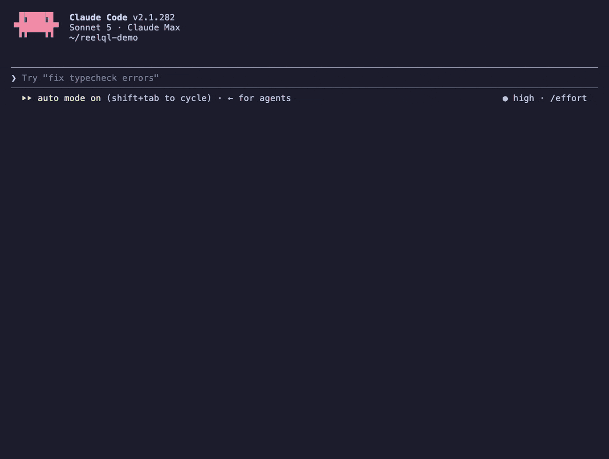

# ReelQL: give your agent eyes

**⭐ Star the repo** (and Watch → Releases to hear about updates), and follow [@tomcupr](https://x.com/tomcupr) on X for launch news and tester keys.

Paste any video link and get back one typed JSON document: summary, chapters, scenes, cast, key moments, the emotional arc, products and brands, on-screen text and the full transcript. ReelQL watches the video, and [Jev](https://docs.typesafe.ai) turns what it saw into decisions your code can branch on.



<sub>"analyze this video" in Claude Code, on a 6-second Starbucks TikTok. Real run, played at 1.5×.</sub>

| Video | Length | Link to JSON |
|---|---|---|
| Starbucks TikTok | 0:06 | 16 s |
| MKBHD LG G5 unboxing | 4:00 | 23 s |
| Phone review | 10:34 | 57 s |
| Walking tour, no speech | 14:05 | 65 s |

No key yet? [`examples/`](examples) has the full output for five brand TikToks and the Jev ranking of them.

## Why ReelQL + Jev

Agents can read, but they can't watch. Jev, TypeSafe's judgment model, reads text only; its docs say to turn video into text or structured fields first. ReelQL is that step:

1. **ReelQL watches.** A link goes in, and one JSON document comes out with every field timestamped.
2. **Jev judges.** Give Jev the fields you care about and ask typed questions: is this on brief, is it brand-safe, which moment fits best? You get probabilities back, not prose to parse.
3. **Your code decides.** Sort, filter, route or flag on real numbers.

With both keys set, just ask Claude to rank some ads against a brief. The skill runs every link through ReelQL, then its bundled [`scripts/jev.py`](skills/reelql/scripts/jev.py) asks Jev five questions per video. Those are on brief, hook, product in use, emotional payoff and unsafe content:



<sub>Five brand TikToks ranked against "family-friendly, shows the product in use". Samsung wins at 77% because its ad is the product doing something; Nat Geo lands at 6% because it isn't an ad. Real run, played at 2.5×.</sub>

The same pairing in your own code:

```python
from typesafe_sdk import Choice, Noul, Score, TypeSafeClient

a = video["analysis"]              # a ReelQL result
brief = "Upbeat, family-friendly, shows the product in use"
state = {"summary": a["summary"], "tone": a["story"]["tone"], "brands": a["brands"],
         "moments": {str(i): m["what"] for i, m in enumerate(a["key_moments"])},
         "transcript": " ".join(s["text"] for s in video["speech"]["transcript"])}

with TypeSafeClient() as jev:      # reads TYPESAFE_API_KEY
    r = jev.system_one(state=state, questions={
        "unsafe":   Noul(instructions="Does `transcript` contain profanity, violence or adult content?"),
        "on_brief": Noul(instructions={"brief": brief, "question": "Does the video match `brief`?"}),
        "fit":      Score(instructions={"brief": brief, "question": "How well does `tone` fit `brief`?"},
                          criteria=["Contradicts it", "Neutral", "Clearly fits"]),
        "best":     Choice(instructions={"brief": brief, "question": "Which of `moments` best matches `brief`?"},
                           criteria={**{k: None for k in state["moments"]}, "none": None}),
    })

print(r.nouls["unsafe"].noul, r.nouls["on_brief"].noul, r.scores["fit"].score, r.choices["best"].choice)
```

Other things you can build from the same pairing:

| Recipe | ReelQL fields in | Jev question out |
|---|---|---|
| Brand safety | `transcript`, `on_screen_text`, `scenes[].action` | one yes/no per hazard, plus a severity score |
| On-brief check | `summary`, `story.tone`, `story.themes`, `advertiser` | "matches the brief?" and a fit score |
| Cut-down picker | `key_moments`, `scenes` | which moment best matches the brief |
| Rank a batch | the same fields for many videos | hook, product clarity, emotional payoff scores, then sort in code |
| Verify placements | `products[].appearances`, `transcript` | is each product claim supported by the evidence? |

Send Jev only the fields a question needs, not the whole document: a long video's transcript can exceed Jev's context. Do numeric comparisons (views, likes) in code. Jev is made by [TypeSafe](https://docs.typesafe.ai); ReelQL is not affiliated with them.

## Get started

**1. Get a key.** ReelQL is in private testing. DM [@tomcupr on X](https://x.com/tomcupr) and you'll get a personal key.

**2. Install the skill.**

Claude Code:

```sh
claude plugin marketplace add tomascupr/reelql
claude plugin install reelql@reelql
export REELQL_API_KEY=<your key>
export TYPESAFE_API_KEY=<your Jev key>   # optional, from console.typesafe.ai: rankings and judgments with Jev
```

Then paste a link: *"analyze this video <url>"* gets you a short brief, or ask something specific such as *"when does the product first appear?"*

claude.ai (Team and Enterprise): download [`reelql.zip`](https://github.com/tomascupr/reelql/releases/latest/download/reelql.zip), upload it under Settings → Capabilities → Skills, and paste your key when Claude asks. An organization owner must first add `reelql.tail6c0e2d.ts.net` to the allowed domains for code execution. On Pro and Max the sandbox only reaches package registries, so use Claude Code there.

Any other agent, or plain `curl`:

```sh
API=https://reelql.tail6c0e2d.ts.net; H="X-API-Key: $REELQL_API_KEY"
curl -s -H "$H" -H 'Content-Type: application/json' $API/jobs -d '{"url": "https://www.youtube.com/watch?v=..."}'
# {"id": "6b0550c3dc9f", "status": "queued"}
curl -s -H "$H" $API/jobs/6b0550c3dc9f   # queued, running, then done (with "result") or failed (with "error")
```

A 4-minute video takes about 25 seconds and a 15-minute one about a minute.

## What you get back

An excerpt from the Starbucks TikTok in the demo:

```json
{
  "schema_version": "1.2",
  "video": { "title": "cat's outta the bag. see you 10.22.", "channel": "starbucks", "platform": "TikTok",
             "duration_s": 6.3, "stats": { "view_count": 12000000, "like_count": 539800 } },
  "analysis": {
    "summary": "A mysterious black cat walks across a dark marble surface, leading to the reveal of the new Starbucks Black Cat Frappuccino with whipped cream and chocolate ears, announced as available from October 22.",
    "advertiser": "Starbucks",
    "brands": ["Starbucks", "Frappuccino"],
    "products": [{ "name": "Starbucks Black Cat Frappuccino", "brand": "Starbucks", "category": "Beverage",
                   "appearances": [{ "t_s": 3.0, "prominence": "Central focus of the latter part of the video." }] }],
    "emotional_arc": [
      { "t_s": 0.0, "emotion": "curiosity",    "intensity": 3, "cue": "Mysterious appearance of the black cat" },
      { "t_s": 3.0, "emotion": "anticipation", "intensity": 4, "cue": "Reveal of the Starbucks cup" },
      { "t_s": 4.4, "emotion": "excitement",   "intensity": 3, "cue": "Announcement of the Black Cat Frappuccino" }
    ],
    "on_screen_text": [{ "t_s": 4.4, "text": "BLACK CAT FRAPPUCCINO 10.22" }]
  }
}
```

The full document also has `story`, `characters`, `audio`, `chapters` (one per 30 seconds), `scenes`, `key_moments`, a speaker-labelled `transcript` and per-step `timing`. The skill file, [`skills/reelql/SKILL.md`](skills/reelql/SKILL.md), lists every field.

- All times are seconds from the start of the video.
- A person's name appears only when the title, channel, on-screen text or transcript contains it. Otherwise ReelQL uses a short label such as "young girl", because the model would otherwise make names up.
- `emotional_arc` is what the viewer is meant to feel, drawn from a fixed list of 21 emotions, so arcs can be compared across videos.
- `advertiser` and `brand` are `null` when nothing in the video supports them.

## Limits

- Any public video that yt-dlp can fetch (YouTube, TikTok, Vimeo and many more), or a direct link to a media file.
- Up to 30 minutes and 4 GB per video. No live streams, and nothing behind a login.
- Two jobs queued or running per key. Results are kept for a day.
- This is a test service with no uptime promise. A restart forgets jobs in progress; submit again if a job id returns 404.
- ReelQL keeps the fetched video and the result on its server. Don't send anything you aren't allowed to share.

The analysis runs on open models on our own GPUs, with no third-party AI APIs.

Built by [@tomcupr](https://x.com/tomcupr). If ReelQL is useful to you, star the repo, tell me what you built with it on X, and send the videos it gets wrong: those are the ones that improve it.
